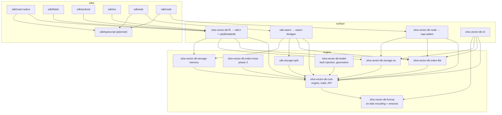

# 3. System Architecture

## 3.1 Layer model

```text
┌─────────────────────────────────────────────────────────────────────────────┐
│  Application code (your app)                                                │
├─────────────────────────────────────────────────────────────────────────────┤
│  Platform SDK          TS / Dart / Kotlin / Swift — idiomatic, typed, async │
│                        Owns: threading model, lifecycle, error mapping      │
├─────────────────────────────────────────────────────────────────────────────┤
│  Binding               JSI (RN) │ dart:ffi │ JNI │ Swift/C │ N-API │ WASM   │
│                        Owns: marshalling, handle ownership, no logic        │
├─────────────────────────────────────────────────────────────────────────────┤
│  Stable ABI            vdb.h  — the frozen contract; ~35 C functions        │
├─────────────────────────────────────────────────────────────────────────────┤
│  Public Rust API       Database / Collection / Snapshot / Query / Error     │
├─────────────────────────────────────────────────────────────────────────────┤
│  Database Core         catalog, write path, read path, txn/batch, stats     │
│      ├── Search        metric kernels, filter evaluation, top-K selection   │
│      ├── Index         VectorIndex trait  →  Flat (v1), HNSW (v3)           │
│      ├── Segment       immutable vector/metadata/id blocks + tombstones     │
│      └── Validation    dimensions, ids, metadata types, limits              │
├─────────────────────────────────────────────────────────────────────────────┤
│  Persistence           manifest (dual-slot), WAL, recovery, compaction,     │
│                        format versioning + migration                        │
├─────────────────────────────────────────────────────────────────────────────┤
│  Storage trait         Storage / File / FileLock / StorageCapabilities      │
├─────────────────────────────────────────────────────────────────────────────┤
│  Storage impls         memory │ os (std::fs + mmap) │ opfs (wasm)           │
├─────────────────────────────────────────────────────────────────────────────┤
│  Host filesystem       APFS │ ext4/F2FS │ NTFS │ OPFS │ RAM                 │
└─────────────────────────────────────────────────────────────────────────────┘
```

**The single most important rule:** every arrow points downward, and nothing at or below the
"Public Rust API" line knows which platform it is on. Platform knowledge enters *only* by
constructing a `Storage` implementation and handing it to `Database::open`.

## 3.2 Dependency graph (crates)



Note what is **absent**: `isha-vector-db-core` depends on nothing but `isha-vector-db-format`. Index and storage crates
depend on `isha-vector-db-core` (for its traits), not the other way round — the engine receives them as
`Box<dyn Storage>` / `Box<dyn VectorIndex>` from the caller or from a registry. This inversion is
what makes it possible to build a mobile binary that contains only flat+os and a web binary that
contains only flat+opfs.

## 3.3 Repository structure (and why it differs from the sketch in the brief)

```text
vdb/
├── Cargo.toml                     # workspace root
├── rust-toolchain.toml            # pinned toolchain; MSRV enforced in CI
├── deny.toml                      # cargo-deny: licenses, advisories, bans
├── crates/
│   ├── isha-vector-db-core/
│   │   ├── src/
│   │   │   ├── lib.rs
│   │   │   ├── api/               # Database, Collection, Snapshot — the public surface
│   │   │   ├── catalog/           # collection registry, schema, open/close lifecycle
│   │   │   ├── document/          # Document, Record, RowId, DocId
│   │   │   ├── vector/            # VectorView, dimension, dtype, normalization
│   │   │   ├── metadata/          # Value model, typed accessors
│   │   │   ├── filter/            # filter AST + evaluator + planner
│   │   │   ├── search/            # metrics, kernels, TopK selector, scoring contract
│   │   │   ├── index/             # VectorIndex trait, IndexRegistry, IndexKind
│   │   │   ├── segment/           # in-memory view over immutable segments, tombstones
│   │   │   ├── write/             # write path: validation → WAL → memtable → flush
│   │   │   ├── persistence/       # manifest, WAL, recovery, compaction, migration
│   │   │   ├── storage/           # Storage/File traits + capability model
│   │   │   ├── concurrency/       # snapshot handles, writer mutex, epoch reclamation
│   │   │   ├── txn/               # atomic batch, (later) transaction
│   │   │   ├── stats/             # counters, DatabaseStats, CollectionStats
│   │   │   ├── validation/        # limits + input checks, one place
│   │   │   ├── error/             # DbError tree, ErrorCode, context
│   │   │   └── util/              # crc32c, varint, bitmap, small-vec, ordered-float
│   │   └── tests/                 # integration tests against the public API only
│   ├── isha-vector-db-format/                # byte layouts, headers, encoders/decoders, versions
│   │   ├── src/
│   │   ├── fuzz/                  # cargo-fuzz targets, one per decoder
│   │   └── tests/golden/          # committed v1 fixture files (never regenerate blindly)
│   ├── isha-vector-db-index-flat/
│   │   └── src/{lib.rs, scalar.rs, simd_x86.rs, simd_neon.rs, simd_wasm.rs}
│   ├── isha-vector-db-index-hnsw/            # phase 3
│   ├── isha-vector-db-storage-memory/
│   ├── isha-vector-db-storage-os/            # std::fs, file locks, optional memmap2
│   ├── vdb-storage-opfs/          # wasm32 only
│   ├── isha-vector-db-testkit/               # FaultyStorage, dataset generators, recall harness
│   ├── isha-vector-db-ffi/                   # C ABI; cbindgen config; include/vdb.h checked in
│   ├── isha-vector-db-node/                  # napi-rs
│   ├── vdb-wasm/                  # wasm-bindgen
│   └── isha-vector-db-cli/                   # inspect | verify | compact | migrate | bench | dump
├── sdk/
│   ├── typescript/                # shared types + high-level API, zero native deps
│   ├── node/                      # npm: @isha-vector-db/node  (+ optional platform packages)
│   ├── web/                       # npm: @isha-vector-db/web   (wasm + dedicated worker + OPFS)
│   ├── react-native/              # npm: @isha-vector-db/react-native (JSI/TurboModule)
│   ├── flutter/                   # pub: vdb  (ffigen bindings + Dart API)
│   ├── android/                   # AAR: Kotlin API + JNI shim + prefab
│   └── ios/                       # SwiftPM + Podspec, XCFramework, Swift API
├── examples/{node,web,react-native,flutter,android,ios,cli}/
├── benchmarks/                    # harness, datasets manifest, results/ (committed JSON)
├── docs/{architecture,adr,api,format,platform,guides,contributing}/
├── scripts/                       # build-xcframework.sh, build-android.sh, gen-header.sh, ...
├── testdata/                      # golden DBs per format version, corrupt-file corpus
├── .github/{workflows,ISSUE_TEMPLATE,PULL_REQUEST_TEMPLATE.md}
├── README.md  LICENSE  CONTRIBUTING.md  CODE_OF_CONDUCT.md  SECURITY.md  CHANGELOG.md
```

### Deviations from the proposed layout, and the reasoning

| Change | Why |
|---|---|
| `crates/` workspace instead of a single `core/src/...` tree | Cargo needs crate roots. More importantly, making storage and index implementations *separate crates* means the compiler enforces the layering: `isha-vector-db-index-flat` physically cannot reach into persistence internals. Directories inside one crate enforce nothing. |
| Top-level `storage/` and `indexes/` folded into `crates/` | They are Rust crates like any other. Keeping them top-level suggests they are a different kind of thing; they are not, and the split would just add path noise. |
| `bindings/` folded into `crates/` (`isha-vector-db-ffi`, `vdb-wasm`, `isha-vector-db-node`) and `sdk/` (JNI/ObjC shims) | `ffi`/`wasm`/`node` *are* Rust crates. The JNI and Objective-C shims are packaging artifacts of the Android/iOS SDKs and belong next to the Gradle/Xcode projects that build them, not in a separate tree that no build system owns. |
| New crate: `isha-vector-db-format` | The on-disk format deserves its own crate, its own fuzz corpus, its own golden fixtures, and its own semver. The `migrate` tool must be able to read *old* formats without linking the current engine. Splitting it now is cheap; splitting it after v1 is not. |
| New crate: `isha-vector-db-testkit` | Fault-injection storage and dataset generators are needed by core tests, the CLI, and the benchmarks. Without a shared crate they get copy-pasted three times. |
| New package: sdk/typescript (**planned, not built**) | Node, Web and React Native share one API surface and one set of docs. Only the transport differs. Three hand-written TS APIs would drift within two releases. Each SDK currently carries its own hand-written surface, which is exactly the drift this was meant to prevent. |
| `testdata/` at repo root | Golden files are consumed by `isha-vector-db-format`, `isha-vector-db-cli` and the migration tests. Root-level makes the shared ownership obvious. |

## 3.4 Module responsibilities

Each module owns exactly one concern, and the "must not" column is the load-bearing part.

| Module | Owns | Must not |
|---|---|---|
| `api` | The public types users touch; argument validation entry point; converting internal errors to public ones | Contain algorithms or touch files |
| `catalog` | Collection registry, per-collection schema (dimension, metric, index kind), open/close state machine | Know the byte layout of anything |
| `document` | `DocId` (external, string/u64), `RowId` (internal, dense u64), `Document` assembly | Perform I/O |
| `vector` | `VectorView<'a>` borrowed slices, dimension checks, dtype tag, norm cache | Own memory for stored vectors (segments do) |
| `metadata` | `Value` enum + typed accessors + size limits | Define the wire encoding (that's `isha-vector-db-format`) |
| `filter` | Filter AST, type-coercion rules, evaluator, planner (bitmap prefilter vs streaming) | Read files |
| `search` | Metric kernels dispatch, scoring contract, `TopK` heap, tie-breaking | Know about indexes or storage |
| `index` | `VectorIndex` trait, `IndexRegistry`, index lifecycle (build/save/load/rebuild) | Implement any specific algorithm |
| `segment` | Immutable segment view: vector block, metadata block, id block, live bitmap | Write files (persistence does) |
| `write` | Validate → append to WAL → apply to memtable → trigger flush | Decide durability policy (config does) |
| `persistence` | Manifest slots, WAL frames, recovery replay, flush, compaction, migration driver | Contain query logic |
| `storage` | The `Storage`/`File` traits and `StorageCapabilities` | Contain any implementation |
| `concurrency` | Snapshot acquisition/release, writer serialization, resource reclamation | Spawn threads |
| `txn` | Batch atomicity, rollback semantics | Perform I/O directly |
| `validation` | All limits in one table; all input predicates | Be bypassed by any other module |
| `error` | `DbError` tree, stable `ErrorCode`, context attachment | Format for a specific platform |
| `util` | crc32c, varint, roaring-lite bitmap, ordered float wrapper | Grow into a general-purpose library |

## 3.5 Threading model (core)

The core is **synchronous and thread-agnostic**. It exposes `Send + Sync` handles and never spawns
a thread, never sleeps, never touches a clock without one being injected. Async-ness, thread pools
and cancellation are **SDK-layer concerns**, because each platform has a different right answer
(libuv threadpool in Node, a Dart helper isolate in Flutter, a dedicated Worker in the browser,
`Dispatchers.IO` in Kotlin).

Rationale: an engine that owns a runtime forces that runtime on every embedder, and it makes the
core untestable deterministically. An engine that owns no runtime can be driven by any of them.
